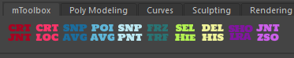

# mToolbox



A collection of personal python based tools for Maya for rigging purposes

## Overview

Macros for used commands such as:
- Toggle LRAs
- Freeze Transforms
- Select Hierarchy
- Delete History
- Smarter Create Locator (at selection/at world origin)
- Snap To Average 
- Snap To Parent (for multiple objects)
- Create Joint Chain (customizable)

Next plans:
- Dedicated UI window (PySide) to bundle all the tools
- Customization options for Create Joint Chain

## Installaton: 
1. Clone or download this repository
2. Copy the `mtoolbox` folder into your `maya/####/scripts/` folder
3. Drag and drop `install_drag_n_drop.py` into the Maya viewport
4. A new shelf called `mToolbox` will be created automatically

## Notes: 
- Icons are installed automatically
- Tools are standalone python modules and can be installed one by one via shelfButton command:
```
from mtoolbox.tools.MODULE_NAME import MODULE_NAME 
MODULE_NAME()"
```
